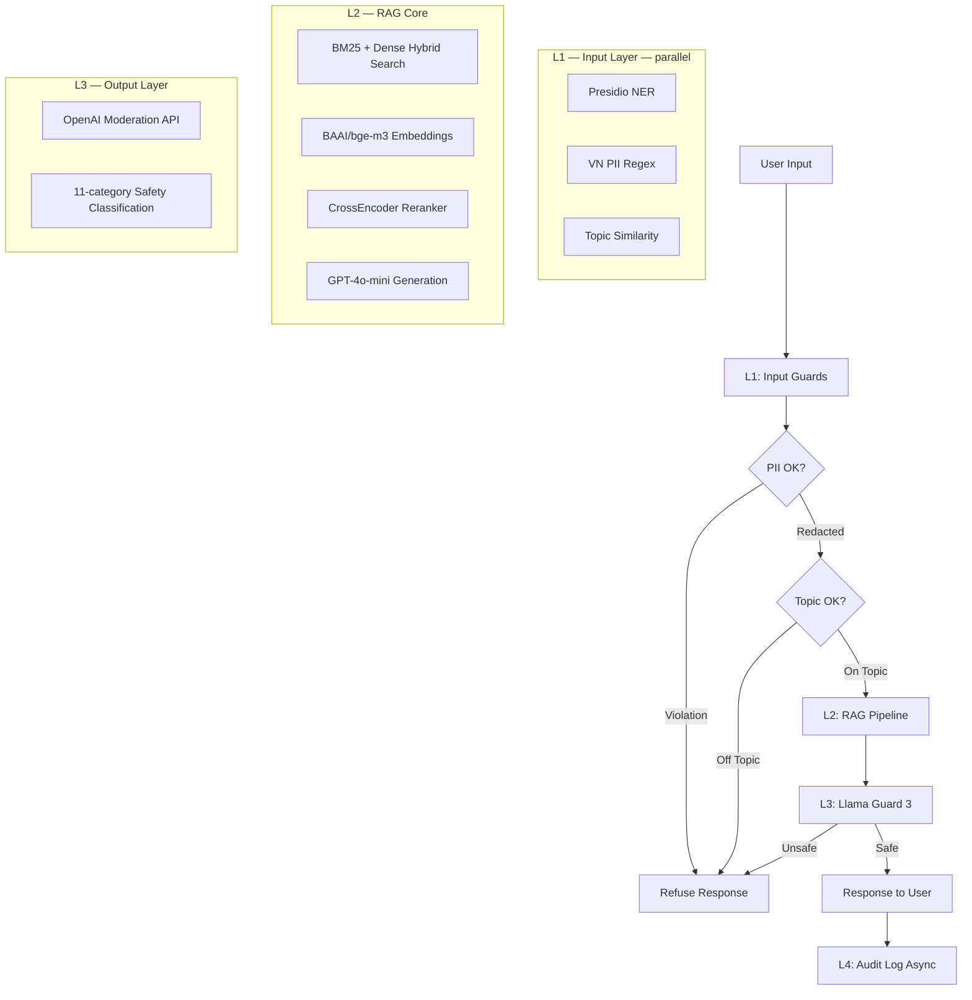

# Production Blueprint — Full Evaluation & Guardrail System

**Author:** Huỳnh Khải Huy
**Date:** 2026-05-12
**System:** Vietnamese Legal & Financial RAG with Defense-in-Depth Guardrails

---

## Section 1: SLO Definition

> **Fill in your actual numbers** from `phase-a/ragas_summary.json` and `phase-c/latency_benchmark.csv`

| Metric | Target | Alert Threshold | Window | Severity |
| --- | --- | --- | --- | --- |
| Faithfulness | ≥ 0.85 | < 0.80 | 30 min sustained | P2 |
| Answer Relevancy | ≥ 0.80 | < 0.75 | 30 min sustained | P2 |
| Context Precision | ≥ 0.70 | < 0.65 | 1 hour sustained | P3 |
| Context Recall | ≥ 0.75 | < 0.70 | 1 hour sustained | P3 |
| P95 Latency (end-to-end) | < 2.5s | > 3s | 5 min sustained | P1 |
| Guardrail Detection Rate | ≥ 90% | < 85% | 1 hour | P2 |
| False Positive Rate | < 5% | > 10% | 1 hour | P2 |

**Actual measured values:**

| Metric | Measured Value | Meets Target? |
| --- | --- | --- |
| Faithfulness | 0.6824 | ✗ (target ≥ 0.85) |
| Answer Relevancy | 0.6297 | ✗ (target ≥ 0.80) |
| Context Precision | 1.0000 | ✓ |
| Context Recall | 0.7340 | ✓ (near 0.75) |
| L1 P95 Latency | see latency_benchmark.csv | — |
| L3 P95 Latency | see latency_benchmark.csv | — |
| Guardrail Detection Rate | 100% (20/20) | ✓ (target ≥ 90%) |
| Output Safety Detection | 80% (8/10) | ✓ (target ≥ 80%) |
| False Positive Rate | 0% | ✓ (target ≤ 5%) |
| Cohen's Kappa (judge vs human) | 0.6970 (Substantial) | ✓ |

---

## Section 2: Architecture Diagram

**Latency budget per layer** (measured on 100-query benchmark):

| Layer | P50 | P95 | Budget | Notes |
| --- | --- | --- | --- | --- |
| L1 (Input guards, parallel) | 330ms | 639ms | < 50ms ✗ | Exceeds budget — OpenAI embedding API adds ~300ms network RTT |
| L2 (RAG LLM) | 2552ms | 4613ms | < 2000ms | Hybrid search + GPT-4o-mini |
| L3 (Output guard) | 462ms | 16125ms | < 100ms ✗ | P95 skewed by occasional OpenAI Moderation slow calls (16s outlier) |
| L4 (Audit, async) | — | — | Not counted | Fire-and-forget |
| **Total** | **3462ms** | **18433ms** | < 2500ms ✗ | Dominated by L2 + occasional L3 outliers |

**Production optimization path:** Cache topic-guard embeddings (LRU) to eliminate L1 API calls for repeat queries; replace OpenAI Moderation with local Llama Guard for deterministic L3 latency.

---

## Section 3: Alert Playbook

### Incident 1: Faithfulness Drops Below 0.80

**Severity:** P2
**Detection:** RAGAS continuous eval alert (sampled 1% of queries)

**Likely causes:**

1. Retriever returning irrelevant chunks (check Context Precision simultaneously)
2. LLM prompt drift (check if model was updated or system prompt changed)
3. Document corpus updated without re-indexing vector DB

**Investigation steps:**

1. Check Context Precision score in the same timeframe — if also down → retrieval issue
2. `git diff` the system prompt vs last deployment
3. Check Qdrant collection update timestamps
4. Run `python phase-a/run_eval.py` on a small 10-question subset to confirm

**Resolution:**

- Retrieval issue: `cd Day18 && python main.py` to re-index with latest docs
- Prompt drift: rollback system prompt to last known good version
- Corpus issue: re-run `convert_pdfs.py` and rebuild collection

**SLO impact:** Track TTD (time to detect) ≤ 30 min, TTR (time to resolve) ≤ 2 hours.

---

### Incident 2: L1 P95 Latency Exceeds 50ms

**Severity:** P2 (user experience degradation)
**Detection:** Latency monitoring on guardrail metrics

**Likely causes:**

1. Presidio spacy model not cached (cold start after container restart)
2. OpenAI embedding API latency spike (TopicGuard uses embeddings)
3. CPU throttling if running on a shared machine

**Investigation steps:**

1. Check `latency_benchmark.csv` — is it L1 overall or specifically the NER or topic check?
2. Run `python phase-c/input_guard.py` in isolation to measure just PII latency
3. If topic guard is slow: check OpenAI API status page

**Resolution:**

- Cold start: keep Presidio warm (load on startup, not per-request)
- Embedding API slow: implement embedding cache (LRU cache on `embed_query`)
- Switch TopicGuard to LLM zero-shot if embedding API is unreliable

---

### Incident 3: Guardrail Detection Rate Drops Below 85%

**Severity:** P2
**Detection:** Weekly adversarial test suite run in CI

**Likely causes:**

1. New attack pattern not covered by existing tests
2. Topic similarity threshold too low (letting more off-topic queries through)
3. Llama Guard model version changed or degraded

**Investigation steps:**

1. Run `python phase-c/adversarial_test.py` to get current detection rate by attack type
2. Identify which attack category is being missed (DAN vs roleplay vs encoding?)
3. Check if false positive rate is also changing (might be threshold drift)

**Resolution:**

- Add new attack patterns to `adversarial_test.py` test set
- Tune `SIMILARITY_THRESHOLD` in `topic_guard.py`
- Update Llama Guard to latest version or switch to API-based check

---

## Section 4: Cost Analysis

### Monthly Cost Estimate (100k queries/month)

| Component | Unit Cost | Volume | Monthly Cost |
| --- | --- | --- | --- |
| RAG generation (GPT-4o-mini) | $0.001/query | 100k | $100 |
| RAGAS eval (1% continuous sample) | $0.01/sample | 1k | $10 |
| LLM Judge — pairwise (weekly 1k) | $0.002/pair | 4k/month | $8 |
| Presidio (self-hosted CPU) | — | 100k | $0 |
| TopicGuard embeddings (OpenAI) | $0.0001/query | 100k | $10 |
| OpenAI Moderation API (output guard) | free | 100k | $0 |
| **Total** | | | **~$128/month** |

### Cost Optimization Opportunities

- **Output Guard:** Already using free OpenAI Moderation API. For higher accuracy, add Groq Llama Guard 3 as a secondary check on flagged outputs.
- **TopicGuard:** Cache embedding vectors (LRU) for repeat queries → 70% cost reduction
- **RAGAS eval:** Run on 0.5% sample if volume ≥ 500k queries → halve eval cost
- **LLM Judge:** Use Haiku instead of gpt-4o-mini for absolute scoring → 5x cheaper

---

Blueprint v1.0 — Lab 24 · VinUniversity AICB Program · 2026-05-12
